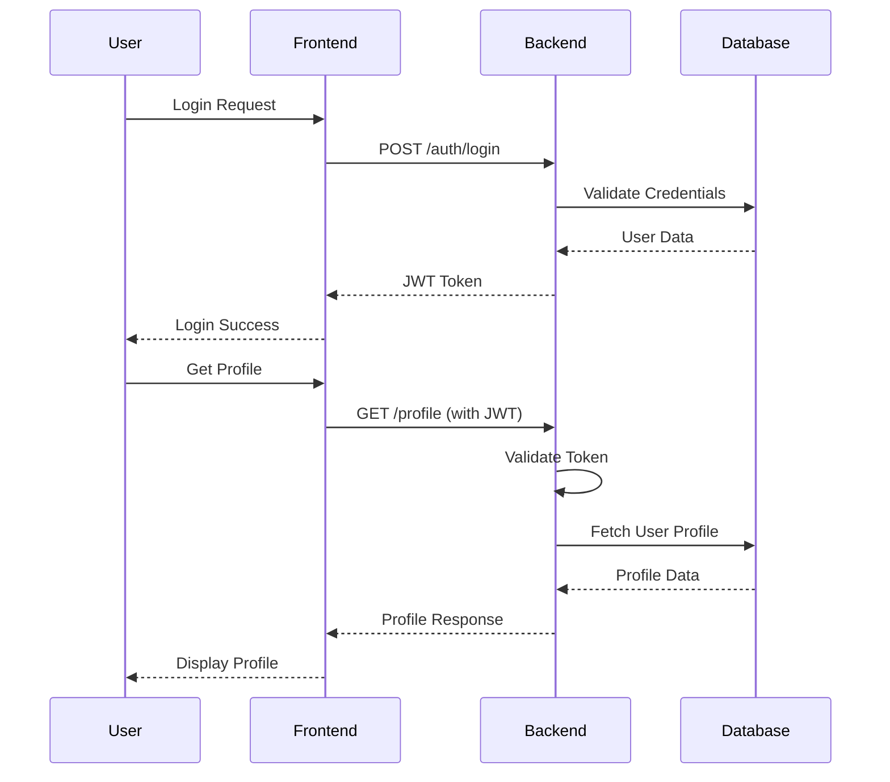
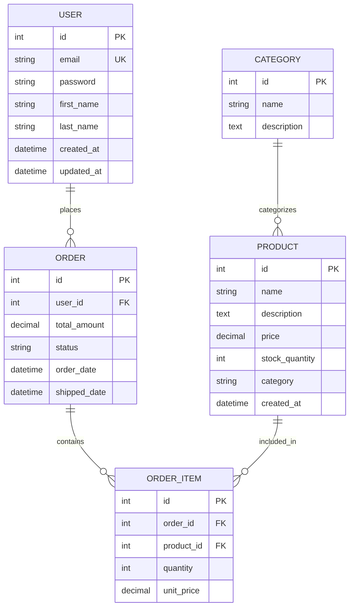
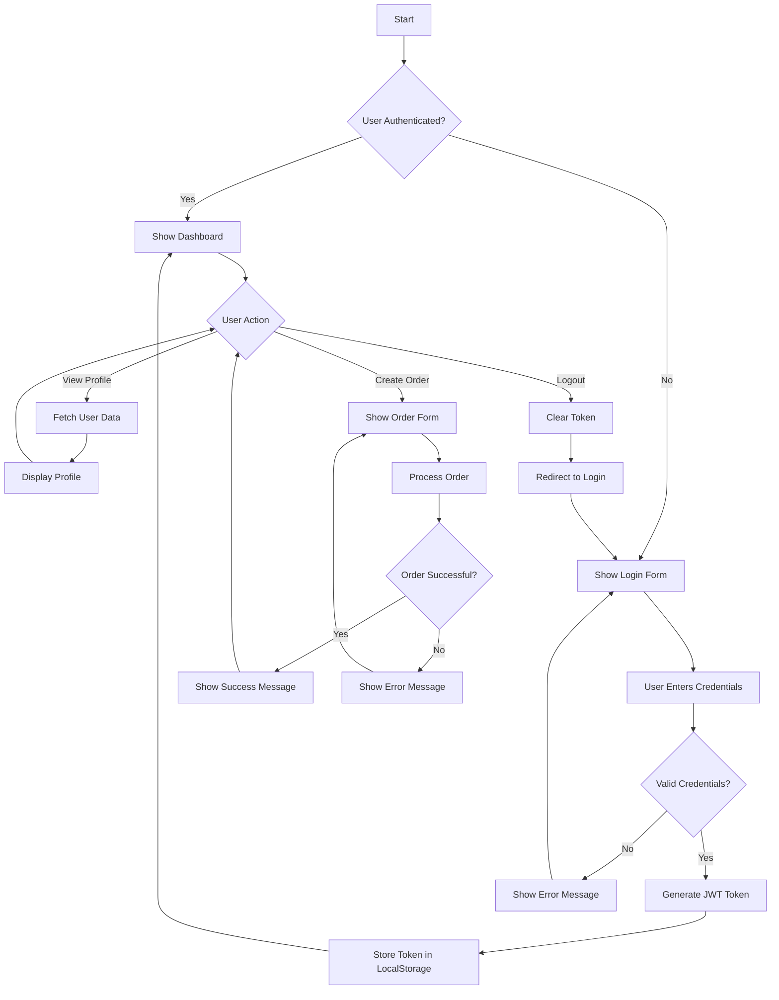
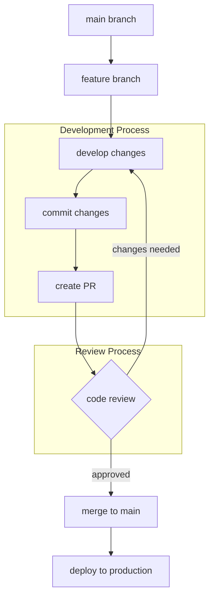
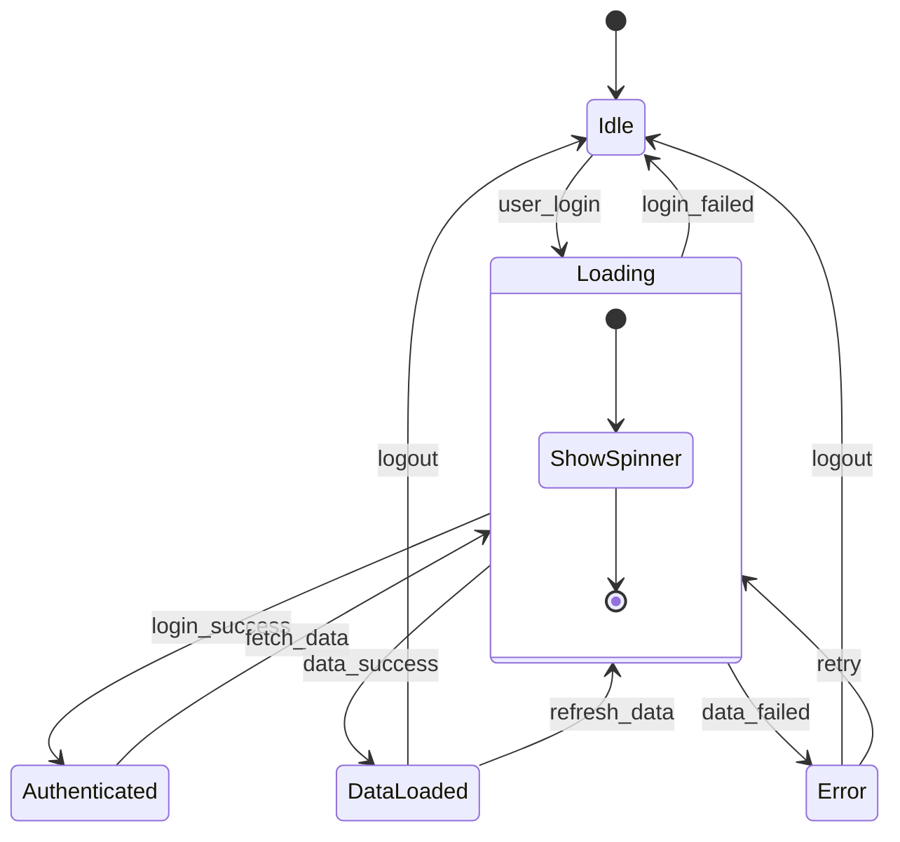

# Project Documentation Test Suite

This document contains comprehensive Markdown formatting examples to test the Doculate extension's conversion capabilities.

## Table of Contents

- [Basic Text Formatting](#basic-text-formatting)
- [Lists and Task Lists](#lists-and-task-lists)
- [Tables](#tables)
- [Code Examples](#code-examples)
- [Diagrams](#diagrams)
- [Advanced Formatting](#advanced-formatting)

---

## Basic Text Formatting

### Paragraph Examples

This is a **regular paragraph** with *italic text*, **bold text**, and ***bold italic text***. You can also use `inline code` within paragraphs.

Here's another paragraph with some special characters: & < > " ' and some Unicode: → ← ↑ ↓ ★ ♦ ◆ ○ ●

> This is a blockquote. It can contain multiple lines and even other formatting like **bold text** and *italic text*.
> 
> Blockquotes can also span multiple paragraphs.

### Different Heading Levels

# Heading 1 - Main Title
## Heading 2 - Major Section
### Heading 3 - Subsection
#### Heading 4 - Sub-subsection
##### Heading 5 - Minor Section
###### Heading 6 - Smallest Heading

---

## Lists and Task Lists

### Unordered Lists

- First item
- Second item with **bold text**
- Third item with *italic text*
  - Nested item 1
  - Nested item 2
    - Deep nested item
- Fourth item with `inline code`

### Ordered Lists

1. First numbered item
2. Second numbered item
3. Third numbered item
   1. Nested numbered item
   2. Another nested item
      1. Deep nested numbered item
4. Fourth numbered item

### Mixed Lists

1. First item
   - Nested bullet point
   - Another nested bullet
2. Second item
   - Mixed nesting works too
3. Third item

### Task Lists

- [x] Completed task
- [x] Another completed task
- [ ] Incomplete task
- [ ] Another incomplete task
  - [x] Nested completed subtask
  - [ ] Nested incomplete subtask

---

## Tables

### Simple Table

| Name | Age | City |
|------|-----|------|
| John | 25 | New York |
| Jane | 30 | London |
| Bob | 35 | Tokyo |

### Complex Table with Formatting

| Feature | Status | Priority | Notes |
|---------|--------|----------|-------|
| **Authentication** | ✅ Complete | High | Uses JWT tokens |
| *User Management* | 🚧 In Progress | Medium | CRUD operations |
| `API Documentation` | ❌ Pending | Low | Swagger integration |
| Database Migration | ✅ Complete | High | PostgreSQL setup |

### Table with Alignment

| Left Aligned | Center Aligned | Right Aligned |
|:-------------|:--------------:|--------------:|
| Left | Center | Right |
| This is left | This is center | This is right |
| Another row | Middle content | End content |

---

## Code Examples

### Inline Code

Use `npm install` to install dependencies. The `console.log()` function prints to console.

### Code Blocks

```javascript
// JavaScript Example
function calculateSum(a, b) {
    return a + b;
}

const result = calculateSum(5, 10);
console.log(`The sum is: ${result}`);
```

```python
# Python Example
def fibonacci(n):
    if n <= 1:
        return n
    return fibonacci(n-1) + fibonacci(n-2)

# Generate first 10 Fibonacci numbers
for i in range(10):
    print(f"F({i}) = {fibonacci(i)}")
```

```sql
-- SQL Example
SELECT 
    u.name,
    u.email,
    COUNT(o.id) as order_count
FROM users u
LEFT JOIN orders o ON u.id = o.user_id
WHERE u.created_at >= '2024-01-01'
GROUP BY u.id, u.name, u.email
ORDER BY order_count DESC;
```

```json
{
  "name": "doculate",
  "version": "1.0.0",
  "description": "Markdown to Word converter",
  "main": "extension.js",
  "dependencies": {
    "marked": "^4.0.0",
    "docx": "^7.0.0"
  }
}
```

---

## Diagrams

### Sequence Diagram



### Entity Relationship Diagram (ERD)



### Flowchart Diagram



### Git Workflow Diagram



### Class Diagram

```mermaid
classDiagram
    class User {
        +int id
        +string email
        +string firstName
        +string lastName
        +datetime createdAt
        +login(email, password) bool
        +logout() void
        +updateProfile(data) bool
    }
    
    class Order {
        +int id
        +int userId
        +decimal totalAmount
        +string status
        +datetime orderDate
        +addItem(product, quantity) void
        +removeItem(productId) void
        +calculateTotal() decimal
        +updateStatus(status) void
    }
    
    class Product {
        +int id
        +string name
        +text description
        +decimal price
        +int stockQuantity
        +string category
        +updateStock(quantity) void
        +isInStock() bool
    }
    
    class OrderItem {
        +int id
        +int orderId
        +int productId
        +int quantity
        +decimal unitPrice
        +getSubtotal() decimal
    }
    
    User ||--o{ Order : places
    Order ||--o{ OrderItem : contains
    Product ||--o{ OrderItem : "is ordered as"
```

### State Diagram



---

## Advanced Formatting

### Links and References

- [External Link](https://www.example.com)
- [Internal Link](#basic-text-formatting)
- [Link with Title](https://www.example.com "Example Website")
- Email: <contact@example.com>
- URL: <https://www.example.com>

### Images


### Horizontal Rules

---

### Strikethrough and Underline

~~This text is strikethrough~~

### Escape Characters

\*This is not italic\* \_This is not italic\_

### HTML in Markdown

<details>
<summary>Click to expand</summary>

This content is hidden by default and can be expanded by clicking the summary.

- Item 1
- Item 2
- Item 3

</details>

### Math Expressions (if supported)

Inline math: $E = mc^2$

Block math:
$$
\sum_{i=1}^{n} x_i = x_1 + x_2 + \cdots + x_n
$$

### Footnotes

This text has a footnote[^1].

[^1]: This is the footnote content.

### Definition Lists

Term 1
: Definition for term 1

Term 2
: Definition for term 2
: Another definition for term 2

### Abbreviations

*[HTML]: HyperText Markup Language
*[W3C]: World Wide Web Consortium

The HTML specification is maintained by the W3C.

---

## Performance Metrics Table

| Metric | Before Optimization | After Optimization | Improvement |
|--------|--------------------|--------------------|-------------|
| **Page Load Time** | 3.2s | 1.1s | 65.6% faster |
| **First Contentful Paint** | 1.8s | 0.6s | 66.7% faster |
| **Largest Contentful Paint** | 4.1s | 1.4s | 65.9% faster |
| **Time to Interactive** | 5.2s | 2.1s | 59.6% faster |
| **Cumulative Layout Shift** | 0.25 | 0.05 | 80% improvement |
| **Bundle Size** | 2.1MB | 890KB | 57.6% smaller |

---

## Conclusion

This document demonstrates various Markdown formatting options including:

1. **Text Formatting**: Bold, italic, strikethrough, inline code
2. **Structural Elements**: Headings, paragraphs, lists, tables
3. **Code Blocks**: Multiple programming languages with syntax highlighting
4. **Diagrams**: Sequence diagrams, ERDs, flowcharts, class diagrams
5. **Advanced Features**: Links, images, HTML, math expressions, footnotes

The Doculate extension should handle all these elements when converting to Word format, with Pandoc providing the best results for complex formatting and diagrams.